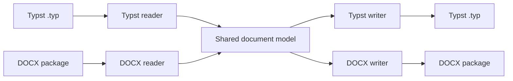

# typx

`typx` is a bidirectional command-line converter between [Typst](https://typst.app/) source files (`.typ`) and Microsoft Word DOCX files (`.docx`). It is written in Python, has no third-party runtime dependencies, and can be distributed as a single executable Python zip application (`.pyz`).

The project targets **Typst 0.15.1** and the current **ECMA-376 / ISO/IEC 29500** Office Open XML family, including the Microsoft Word extension baseline documented by **MS-DOCX 23.0**.

> **Project status:** alpha. The converter already covers a broad set of document structures, but Typst and Word have fundamentally different document and layout models. Read [What fidelity means](#what-fidelity-means) and [Limitations](#limitations) before using it for archival or production workflows.

## Why this project exists

Converting Typst and DOCX is not a matter of replacing markup tokens. A Typst document can contain executable language constructs and layout logic. A DOCX file is a ZIP package containing XML parts, relationships, numbering definitions, styles, media, comments, notes, equations, revisions, and application-specific extensions.

`typx` therefore uses a shared intermediate document model:



This design has three practical advantages:

1. **Both directions are first-class.** The DOCX reader and Typst reader feed the same model rather than converting through an unrelated third format.
2. **Unsupported material can be preserved.** The model contains preservation nodes for structures that cannot safely be translated.
3. **Round-trip behavior is explicit.** Exact source counterparts can be embedded so that an untouched generated file can recover the original source byte for byte.

## Quick start

### Use the single-file application

After downloading a release asset such as `typx-0.1.0.pyz`:

Linux or WSL2:

```bash
python3 typx-0.1.0.pyz report.typ report.docx
python3 typx-0.1.0.pyz report.docx report.typ
```

Windows 11:

```powershell
py typx-0.1.0.pyz report.typ report.docx
py typx-0.1.0.pyz report.docx report.typ
```

The explicit form is equivalent:

```bash
python3 typx-0.1.0.pyz convert report.typ report.docx
python3 typx-0.1.0.pyz convert report.docx report.typ
```

### Run from a source checkout

From the extracted or cloned repository directory:

```bash
python3 -m venv .venv
. .venv/bin/activate
python3 -m pip install .
typx --version
```

Windows PowerShell:

```powershell
py -m venv .venv
.venv\Scripts\Activate.ps1
py -m pip install .
typx --version
```

The installed `typx` command and the `.pyz` application expose the same CLI.

## A small example

Suppose `hello.typ` contains:

```typst
#set page(paper: "a4")
#set text(size: 11pt)

= Quarterly note <intro>

This paragraph has *strong text*, _emphasis_, and a link to
#link("https://typst.app/")[Typst].

- First item
- Second item

$ sum_(i=1)^n i = n(n + 1) / 2 $
```

Convert it with:

```bash
python3 typx-0.1.0.pyz hello.typ hello.docx
```

Going the other way is symmetrical:

```bash
python3 typx-0.1.0.pyz memo.docx memo.typ
```

## What fidelity means

There are several different notions of fidelity, and they should not be conflated.

### Semantic fidelity

The preferred result is a native construct in the target format. Examples include:

- a Typst heading becoming a Word heading paragraph;
- a Word hyperlink becoming a Typst `link`;
- a DOCX numbered list becoming a Typst enumerated list;
- an OMML fraction becoming Typst math;
- a Typst table becoming WordprocessingML table cells and grid definitions.

### Preserved fidelity

Some structures have no safe native equivalent. In those cases `typx` can preserve raw source or raw OOXML so information is not silently discarded.

### Exact counterpart recovery

The optional round-trip layer stores the original source inside the generated target. If the generated document remains eligible for exact recovery, converting it back can return the original bytes rather than reconstructing an approximation.

This is different from semantic conversion. It is a preservation mechanism, not a claim that the two formats are structurally identical.

## Round-trip modes

```bash
python3 typx-0.1.0.pyz convert input.typ output.docx --roundtrip auto
```

| Mode | Meaning |
|---|---|
| `auto` | Recover an eligible exact counterpart; otherwise perform semantic conversion and embed the current source for a future round trip. |
| `exact` | Require exact counterpart recovery and fail if the embedded source is absent or no longer eligible. |
| `semantic` | Always parse and regenerate the target while still embedding the current source unless `--no-embed` is supplied. |
| `off` | Parse and regenerate without embedding a source counterpart. |

The mechanisms are intentionally different in each direction:

- **Typst → DOCX:** the Typst source is stored in a custom XML part with an integrity digest.
- **DOCX → Typst:** the original DOCX package is compressed and stored in a leading Typst block comment.

See [docs/ROUNDTRIP.md](docs/ROUNDTRIP.md) for the details.

## Command tour

### Convert

```bash
typx convert INPUT [OUTPUT] [options]
```

Important options:

```text
--from typst|docx
--to typst|docx
--roundtrip auto|exact|semantic|off
--revisions accept|reject|annotate|preserve
--unknown preserve|drop
--assets-dir PATH
--no-assets
--no-includes
--no-comments
--no-embed
--missing-assets placeholder|error
--force
--json
--quiet
```

### Inspect a document

```bash
typx inspect report.docx --deep
typx inspect report.typ --deep --json
```

Inspection reports information such as block and inline counts, sections, resources, notes, comments, styles, package parts, and exact-counterpart eligibility.

### Validate an input

```bash
typx validate report.docx --deep
typx validate report.typ --deep
```

DOCX validation checks package safety, XML well-formedness, relationships, content types, and optionally semantic parsing.

Typst validation checks the converter's static grammar. **It is not a replacement for compiling the document with the official Typst compiler.** In particular, arbitrary Typst code is outside the scope of this static transpiler.

### Inspect the mapping

```bash
typx mapping --format markdown
typx mapping --format json --query equation
typx mapping --format csv --category Mathematics
```

The repository ships the same mapping in three forms:

- [mapping/MAPPING.md](mapping/MAPPING.md) for reading;
- [mapping/mapping.json](mapping/mapping.json) for tools;
- [mapping/mapping.csv](mapping/mapping.csv) for tabular analysis.

### Dump the intermediate representation

```bash
typx dump-ir report.docx --output report-ir.json
```

This is useful when diagnosing a conversion or developing another front end.

## Coverage at a glance

The mapping contains **442 directional rows across 20 categories**. It covers, among other areas:

- metadata, page geometry, sections, columns, headers, and footers;
- paragraph and character formatting;
- headings, bookmarks, links, fields, references, and citations;
- ordered, unordered, nested, and restarted lists;
- tables, cell spans, borders, shading, widths, and row properties;
- images, drawings, figures, captions, and alternative text;
- Typst math and Word OMML equations;
- footnotes, endnotes, comments, revisions, and content controls;
- Strict and Transitional WordprocessingML input normalization;
- raw OOXML and source-preservation fallbacks.

The detailed status of every mapped construct is documented in [mapping/MAPPING.md](mapping/MAPPING.md) and summarized in [docs/COVERAGE_SUMMARY.md](docs/COVERAGE_SUMMARY.md).

## Limitations

The largest boundary is Typst's programmability. `typx` is a **static transpiler**, not an embedded Typst execution engine. It does not generally execute:

- arbitrary user-defined functions;
- loops whose result requires evaluation;
- plugins;
- dynamic imports or package code;
- contextual state and queries;
- arbitrary `show` rules;
- custom layout closures.

It can convert literal and statically recoverable constructs, preserve source that it cannot prove safe to lower, and recover exact embedded counterparts where possible.

On the DOCX side, some Word-specific facilities are preserved or omitted rather than executed, including embedded applications, ActiveX, macros, signatures, printer data, and some drawing or SmartArt structures.

Visual pagination is also renderer-dependent. Typst and Word use different shaping, line-breaking, table-layout, floating-object, and pagination engines. Equivalent semantics do not guarantee identical page coordinates.

See [docs/LIMITATIONS.md](docs/LIMITATIONS.md) for a more precise inventory.

## Security model

DOCX files are untrusted ZIP packages and XML documents. The reader therefore:

- rejects ZIP path traversal;
- enforces part-count and uncompressed-size limits;
- rejects DTD and entity declarations;
- never executes macros, OLE content, ActiveX, external relationships, or embedded programs;
- treats unknown structures as data for preservation rather than executable code.

Static Typst includes and local assets are constrained to local project paths. General Typst code is not executed by `typx`.

## Repository layout

```text
.
├── .github/                 GitHub Actions and contribution templates
├── docs/                    Architecture, round-trip, limits, development, release docs
├── examples/                Small example Typst and DOCX documents
├── mapping/                 Human and machine-readable Typst ↔ DOCX mapping
├── scripts/                 Reproducible build and release verification tools
├── src/typx/                Application source
├── tests/                   Standard-library unittest suite
├── pyproject.toml           Python package metadata
└── README.md
```

For the internal design, start with [docs/ARCHITECTURE.md](docs/ARCHITECTURE.md).

## Development

The development loop intentionally requires very little tooling:

```bash
PYTHONPATH=src python3 -m unittest discover -s tests -v
python3 -m compileall -q src tests scripts
python3 scripts/build_release.py
python3 scripts/verify_release.py
```

The release builder creates:

```text
dist/typx-X.Y.Z.pyz
dist/typx-X.Y.Z-source.zip
dist/typx-X.Y.Z-bundle.zip
dist/SHA256SUMS.txt
```

The ZIP and `.pyz` writers use fixed timestamps and stable ordering so the outputs are reproducible from the same source tree.

More detail is in [docs/DEVELOPMENT.md](docs/DEVELOPMENT.md) and [CONTRIBUTING.md](CONTRIBUTING.md).

## GitHub Actions

Two workflows are included:

- **CI** runs on pushes and pull requests, tests Python 3.11 through 3.14, compiles the Python files, builds the release artifacts, verifies them, checks reproducibility, and uploads the resulting `dist` files as a workflow artifact.
- **Release** runs when a tag beginning with `v` is pushed. It verifies that the tag exactly matches the package version, runs tests, rebuilds and verifies all release files, then publishes them as GitHub Release assets. It can also be run manually to perform a release build without publishing a GitHub Release.

For version `0.1.0`, publishing is therefore:

```bash
git tag -a v0.1.0 -m "typx 0.1.0"
git push origin v0.1.0
```

The workflow refuses a tag such as `v0.1.1` while the package still declares version `0.1.0`.

See [docs/RELEASING.md](docs/RELEASING.md).

## Publishing this checkout as a new GitHub repository

After extracting the repository ZIP:

```bash
git init
git add .
git commit -m "Initial public release"
git branch -M main
```

If you use GitHub CLI, you can then create and push the repository in one command:

```bash
gh repo create typx --public --source=. --remote=origin --push
```

Once `main` is on GitHub, push a version tag to trigger the automated release workflow.

## Standards baseline and references

| Side | Baseline |
|---|---|
| Typst | 0.15.1, released July 17, 2026 |
| OOXML | ECMA-376 5th edition / ISO/IEC 29500 |
| Microsoft Word extensions | MS-DOCX revision 23.0 |
| DOCX writer | Transitional WordprocessingML for broad compatibility |
| DOCX reader | Transitional plus namespace-normalized Strict WordprocessingML |

Primary references:

- https://typst.app/docs/reference/
- https://github.com/typst/typst/releases/tag/v0.15.1
- https://ecma-international.org/publications-and-standards/standards/ecma-376/
- https://learn.microsoft.com/en-us/openspecs/office_standards/ms-docx/b839fe1f-e1ca-4fa6-8c26-5954d0abbccd

## Contributing and support

Bug reports and focused improvements are welcome. Before opening a pull request, read [CONTRIBUTING.md](CONTRIBUTING.md). Security-sensitive reports should follow [SECURITY.md](SECURITY.md) rather than a public issue.

## License

MIT. Copyright © 2026 Alek Rutkowski.

See [LICENSE](LICENSE), [ACKNOWLEDGMENTS.md](ACKNOWLEDGMENTS.md), and [THIRD_PARTY_NOTICES.md](THIRD_PARTY_NOTICES.md).

This is an independent project and is not affiliated with or endorsed by Typst GmbH, Microsoft, Ecma International, ISO, or IEC.
